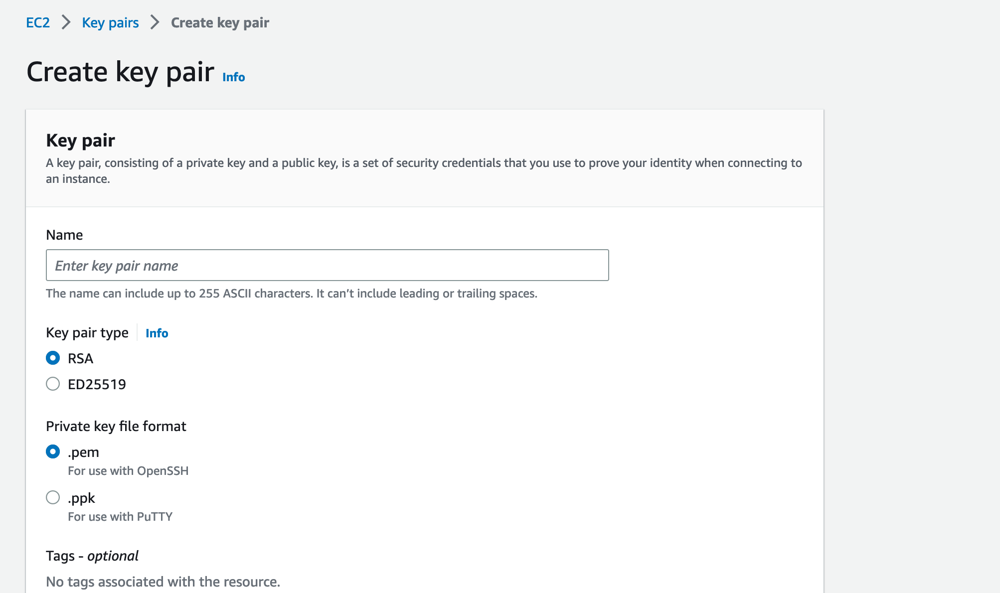
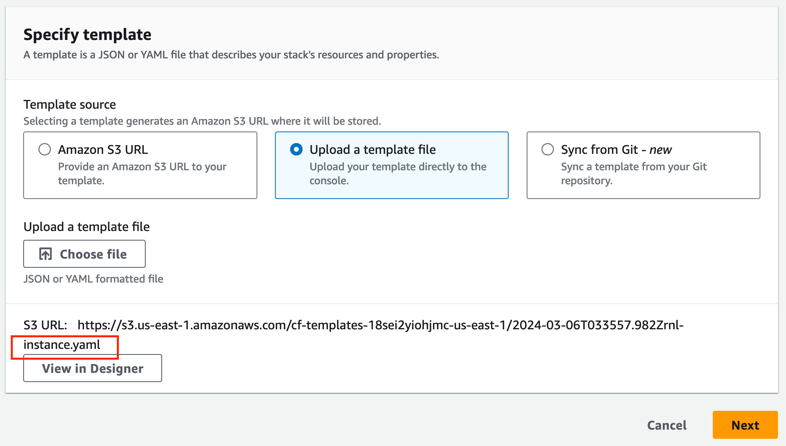
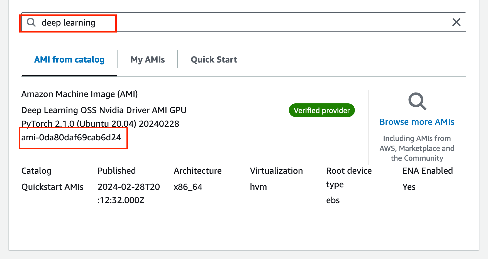
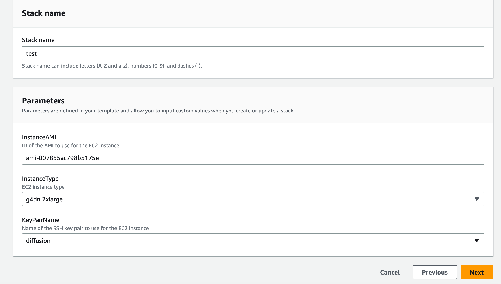
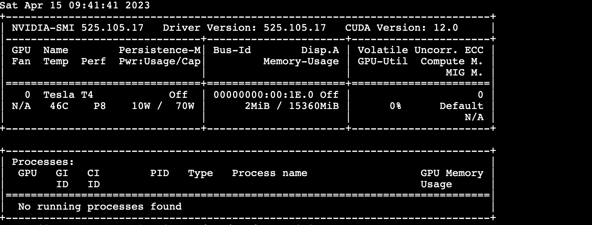

# Ollama One-Click On AWS

# Introduction:

This project utilizes CloudFormation to deploy an AWS G4 EC2 instance (NVIDIA T4) with Ollama Server and Ollama Web UI automatically. Ollama Server is a backend service for managing LLM models and handling natural language requests, while Ollama Web UI is a web-based frontend interface for interacting with Ollama Server. By deploying these two components on an Amazon EC2 instance, you can build a scalable, high-performance, and secure AI platform in the cloud.
Functionality of CloudFormation Template (instance.yaml):
This project provides a CloudFormation template (instance.yaml) with the following functionalities:

- MyVPC: Creates a VPC with a CIDR block set to 10.0.0.0/16. Adds a tag named Name with the value "My VPC" to the VPC.
- MyInternetGateway: Creates an Internet Gateway. Adds a tag named Name with the value "My IGW" to the Internet Gateway.
- MyVPCGatewayAttachment: Attaches the Internet Gateway to the VPC. References MyVPC and MyInternetGateway resources using !Ref.
- MyPublicSubnet: Creates a public subnet in the VPC with a CIDR block set to 10.0.1.0/24. Adds a tag named Name with the value "My Public Subnet" to the subnet.
- MyRouteTable: Creates a route table for the VPC. Adds a tag named Name with the value "My Route Table" to the route table.
- MyDefaultRoute: Creates a route in the route table to direct all other unspecified traffic (0.0.0.0/0) to the Internet Gateway.
- MySubnetRouteTableAssociation: Associates the subnet with the route table.
- MySecurityGroup: Creates a security group with inbound rules allowing TCP traffic on ports 22, 3000, and 11433 from any source (0.0.0.0/0).
- Instance type: Defaults to g4dn.xlarge and can be selected on-demand from g4dn.2xlarge, g4dn.4xlarge, g4dn.8xlarge, g4dn.12xlarge, g4dn.16xlarge.
- Image ID: Selects the image ID for Ubuntu Server 22.04.
- Block device mappings: Sets the size of the EBS volume for the /dev/sda1 device to 100GB and type to gp3.
- Tags: Sets a tag named Name with the value "stablediffusion-onclick".
- Key name: Custom key-pair.
- Network interface: Configures a network interface to associate the security group and public subnet with the instance and allocate a public IP address.
- UserData: Includes command-line instructions for installing and running the stable diffusion environment.
- Parameter: Sets key pair and AMI ID (selects the image for Ubuntu Server 22.04).

First, log in to the Amazon Web Service (AWS) Console and create an EC2 key pair.
Installation and Execution:
Create an EC2 key pair through the AWS Console.
  
Upload template file to console
  
Find the AMI ID through the console interface:
  
Install and run the project through the AWS Console interface:
  
After installation, the interface outputs the IP address for access:
!4](images/output.png)  
Alternatively, you can create a new stack named MyStack using the following command-line AWS CloudFormation template. To install and configure AWS CLI, follow the [AWS CLI official documentation](https://docs.aws.amazon.com/cli/latest/userguide/install-cliv2.html).
bash
Copy code

```
aws cloudformation create-stack \
  --stack-name my-stack \
  --template-body file://instance.yaml \
  --parameters \
      ParameterKey=InstanceAMI,ParameterValue=your-ami-id \
      ParameterKey=KeyPairName,ParameterValue=my-keypair \
  --capabilities CAPABILITY_IAM
```

Note: Use the AMI ID for Ubuntu Server 22.04 and the custom key pair.
To delete the stack, use the `delete-stack` command:
bash
Copy code

```
aws cloudformation delete-stack --stack-name MyStack
```

Wait for about 5 minutes for the EC2 to initialize the environment and install Ollama.

Connect to the EC2 via SSH and tail -f /var/log/cloud-init-output.log to check the installation progress.

Connect to the EC2 via SSH and run nvidia-smi to see the NVIDIA system management interface.

Access the UI interface at the output address http://public_ip/3000 to see the UI interface.

